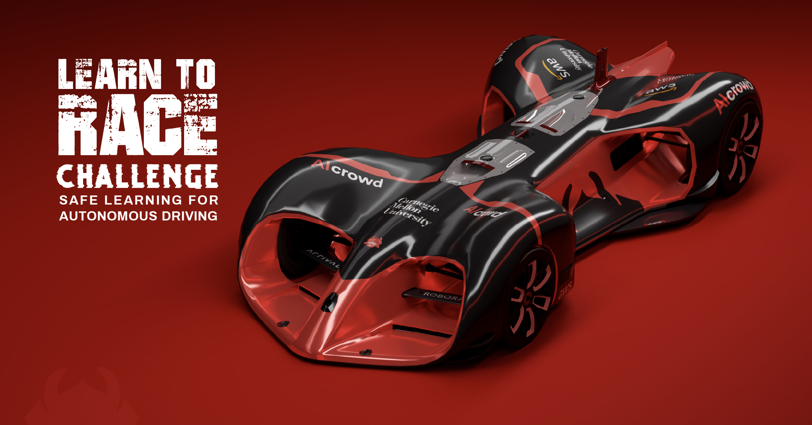

# [Learn to Race Challenge](https://www.aicrowd.com/challenges/iclr-2021-learn-to-race/) | Starter Kit 
[](https://discord.gg/fNRrSvZkry)

This repository is the Learn to Race Challenge **Submission template and Starter kit**! Clone the repository to compete now!

**This repository contains**:
*  **Documentation** on how to submit your models to the leaderboard
*  **The procedure** for best practices and information on how we evaluate your agent, etc.
*  **Starter code** for you to get started!


<!--
//todo: Add starter code
> **NOTE:** 
If you are resource-constrained or would not like to setup everything in your system, you can make your submission from inside Google Colab too. [**Check out the beta version of the Notebook.**](https://colab.research.google.com/drive/14FpktUXysnjIL165hU3rTUKPHo4-YRPh?usp=sharing)
-->


# Table of Contents

1. [Competition Overview](#competition-overview)
2. [Getting Started](#how-to-start-participating)
3. [How do I specify my software runtime / dependencies?](#how-do-i-specify-my-software-runtime-dependencies-)
4. [What should my code structure be like ?](#what-should-my-code-structure-be-like-)
5. [How to make submission](#how-to-make-submission)
6. [Other concepts](#other-concepts)
7. [Important links](#-important-links)


#  Competition Overview
The Learn to Race Challenge is an opportunity for researchers and machine learning enthusiasts to test their skills by developing autonomous agents that can adhere to safety specifications in high-speed racing. Racing demands each vehicle to drive at its physical limits with barely any margin for safety, when any infraction could lead to catastrophic failures. Given this inherent tension, we envision autonomous racing to serve as a particularly challenging proving ground for safe learning algorithms.

### Competition Stages
The challenge consists of two stages: 
- In **Stage 1**, participants will train their models locally, and then upload submit model checkpoints to AICrowd for evaluation on *Thruxton Circuit*, which is included in the Learn-to-Race environment. Each team will be able to submit agents to the evaluation service with a limit of 1 successful submission every 24 hours. The top 10 teams on the leader board will enter **Stage 2**.


- In **Stage 2**, participants will submit their models (with checkpoints) to AICrowd for training on an unseen track for a time budget of one hour, during which the number of safety infractions will be accumulated as one of the evaluation metrics. After the one-hour ‘practice’ period, the agent will be evaluated on the unseen track. Each team may submit up to three times for this stage, and the best results will be used for the final ranking. This is intended to give participants a chance to deal with bugs or submission errors.

//todo: Add a flow chart for Stage 2  

<!-- **The following is a high level description of how this process works** -->


#  Getting Started
1. **Sign up** to join the competition [on the AIcrowd website](https://www.aicrowd.com/challenges/iclr-2021-learn-to-race/).
2. **Download** the Arrival Arrival Autonomous Racing Simulator [from this link](https://learn-to-race.org/sim/).  
2. **Clone** this repo and start developing your autonomous racing agent.
3. **Develop** your autonomous racing agents following the template in [how to write your own agent](#how-to-write-your-own-agent) section.
4. [**Submit**](#how-to-submit-a-model) your trained models to [AIcrowd Gitlab](https://gitlab.aicrowd.com) for evaluation [(full instructions below)](#how-to-submit-a-model). The automated evaluation setup will evaluate the submissions on the racetrack and report the metrics on the leaderboard of the competition.

# How to write your own agent?

We recommend that you place the code for all your agents in the `agents` directory (though it is not mandatory). You should implement the `select_action` method, along with other methods as specified in the [`BaseAgent`](agents/base.py) class. You should also implement the `training` method for local development and for the one-hour 'practice' period in Stage 2.  

```python
from agents.base import BaseAgent


class MyAgent(BaseAgent):
    def __init__(self):
	super.__init__()
      	## Initialize your agent, e.g. 
	self.model = ...
	self.model.load_model(path)

    def select_action(self, obs):
        '''
        # Outputs action given the current observation
        obs: a dictionary
            During local development, the participants may specify their desired observations.
            During evaluation on AICrowd, the participants will have access to
            obs =
            {
              'CameraFrontRGB': front_img, # numpy array of shape (width, height, 3)
              'CameraLeftRGB': left_img, # numpy array of shape (width, height, 3)
              'CameraRightRGB': right_img, # numpy array of shape (width, height, 3)
              'track_id': track_id, # integer value associated with a specific racetrack
              'speed': speed # float value of vehicle speed in m/s
            }
        returns:
            action: np.array (2,)
            action should be in the form of [\delta, a], where \delta is the normalized steering angle, and a is the normalized acceleration.
        '''

    def training(self, env):
        '''
        Implement the training loop here.
        - Local development OR Stage 2 'practice' phase
        '''
```

Update the `SubmissionConfig` in [config.py](config.py#L5) to use your new agent class instead of the `RandomAgent`.

# How to start participating?

## Setup

1. **Add your SSH key** to AIcrowd GitLab

You can add your SSH Keys to your GitLab account by going to your profile settings [here](https://gitlab.aicrowd.com/profile/keys). If you do not have SSH Keys, you will first need to [generate one](https://docs.gitlab.com/ee/ssh/README.html#generating-a-new-ssh-key-pair).

2.  **Clone the repository**

    ```
    git clone git@gitlab.aicrowd.com:learn-to-race/learn-to-race-starter-kit.git
    ```

3. **Install** competition specific dependencies!
    ```
    cd learn-to-race-starter-kit
    pip install -r requirements.txt
    ```

4. Try out the random agent by running `python rollout.py`. You should start the simulator first, by running `bash <simulator_path>/ArrivalSim-linux-0.7.1.188691/LinuxNoEditor/ArrivalSim.sh -openGL`.

5. Write your own agent as described in [how to write your own agent](#how-to-write-your-own-agent) section.

6. Make a submission as described in [how to make a submission](#how-to-make-a-submission) section.

## How do I specify my software runtime / dependencies ?

We accept submissions with custom runtime, so you don't need to worry about which libraries or framework to pick from.

The configuration files typically include `requirements.txt` (pypi packages), `environment.yml` (conda environment), `apt.txt` (apt packages) or even your own `Dockerfile`.

You can check detailed information about the same in the 👉 [RUNTIME.md](docs/runtime.md) file.

## What should my code structure be like ?

Please follow the example structure as it is in the starter kit for the code structure.
The different files and directories have following meaning:

```
.
├── aicrowd.json           # Submission meta information - like your username
├── apt.txt                # Packages to be installed inside docker image
├── requirements.txt       # Python packages to be installed
├── rollout.py             # Entrypoint to test your code locally (DO NOT EDIT, will be replaced during evaluation)
├── config.py              # File containing env, simulator and submission configuration
└── agents                 # Place your agents related code here
    ├── base.py            # Code for base agent
    └── <my_agent>.py      # IMPORTANT: Your agent code
```

Finally, **you must specify an AIcrowd submission JSON in `aicrowd.json` to be scored!** 

The `aicrowd.json` of each submission should contain the following content:

```json
{
  "challenge_id": "evaluations-api-music-demixing",
  "authors": ["your-aicrowd-username"],
  "description": "(optional) description about your awesome agent",
  "external_dataset_used": false
}
```

This JSON is used to map your submission to the challenge - so please remember to use the correct `challenge_id` as specified above.

## How to make a submission?

👉 [SUBMISSION.md](/docs/SUBMISSION.md)

**Best of Luck** :tada: :tada:

# Other Concepts
### Evaluation Metrics
- **Success Rate**: Each race track is partitioned into a fixed number of segments and the success rate is calculated as the number of successfully completed segments over the total number of segments. If the agent fails at a certain segment, it will respawn stationarily at the beginning of the next segment. If the agent successfully completes a segment, it will continue on to the next segment carrying over the current speed.
- **Average Speed**: Average speed is defined as the total distance traveled divided by total tome.
- **Number of Safety Infractions** (Stage 2 ONLY): The number of safety infractions is accumulated during the 1-hour ‘practice’ period in Stage 2 of the competition. The agent is considered to have incurred a safety infraction if 2 wheels of the vehicle leave the drivable area, the vehicle collides with an object, or does not progress for a number of steps (e.g. stuck). In Learn-to-Race, the agent is considered having failed upon any safety infraction. 

### Ranking Criteria
- In Stage 1, the submissions will first be ranked on success rate, and then submissions with the same success rate will be ranked on average speed.
- In Stage 2, the submissions will first be ranked on success rate, and then submissions with the same success rate will be ranked on a weighted sum of the total number of safety infractions and the average speed. 

### Time constraints
- To prevent the participants from achieving a high success rate by driving very slowly, the maximum episode length will be set based on an average speed of 30km/h. The evaluation will terminate if the maximum episode length is reached and metrics will be computed based on performance up till that point.   


## Local Evaluation
- Participants can run the evaluation protocol for their agent locally with or without any constraint posed by the Challenge to benchmark their agents privately.
- Remember to start the simulator first, by executing `bash <simulator_path>/ArrivalSim-linux-0.7.1.188691/LinuxNoEditor/ArrivalSim.sh -openGL`.
- Participants can familiarize themselves with the code base by trying out the random agent, as a minimal example, by running `python rollout.py`. 
- Upon finishing the `select_action` method in the agent class, one should be able to execute the `evaluation_routine` method in `rollout.py`.
- One should write the training procedures in the `training` method in the agent class, and then one can execute the `training_routine` method in `rollout.py`.

## Contributing

🙏 You can share your solutions or any other baselines by contributing directly to this repository by opening merge request.

- Add your implemntation as `agents/<your_agent>.py`.
- Test it out using `python rollout.py`.
- Add any documentation for your approach at top of your file.
- Import it in `config.py`
- Create merge request! 🎉🎉🎉 

## Contributors

// todo

# 📎 Important links


💪 &nbsp;Challenge Page: https://www.aicrowd.com/challenges/iclr-2021-learn-to-race

🗣️ &nbsp;Discussion Forum: https://www.aicrowd.com/challenges/iclr-2021-learn-to-race/discussion

🏆 &nbsp;Leaderboard: https://www.aicrowd.com/challenges/iclr-2021-learn-to-race/leaderboards
